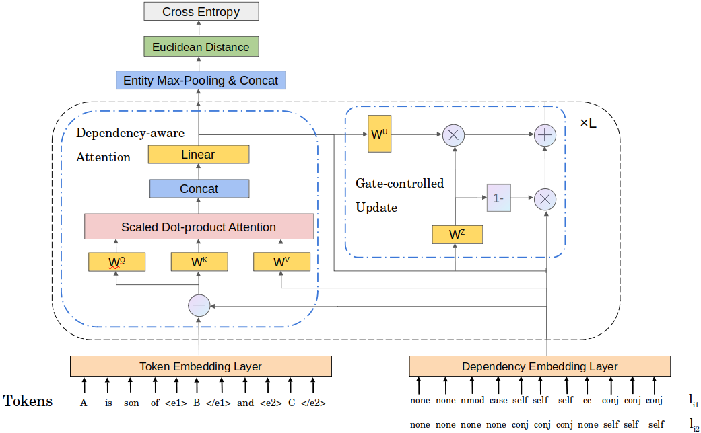

# DAPL





Code and datasets for the COLING2022 short paper [Dependency-aware Prototype Learning for Few-shot Relation Classification].


Requirements
==========

Please `pip install transformer==2.1.1` before running.

Datasets
==========

We provide original training set and validation set of FewRel dataset in `data` folder as `train.txt` and `test.txt`. There is also a `dep_type.json` containing all dependency types.


Run the experiments
==========

# Download pretrained BERT

You can run the following script to download pretrained BERT-base model.

```
mkdir bertmodel
wget -P bertmodel https://huggingface.co/bert-base-uncased/resolve/main/pytorch_model.bin
wget -P bertmodel https://huggingface.co/bert-base-uncased/resolve/main/vocab.txt
wget -P bertmodel https://huggingface.co/bert-base-uncased/resolve/main/config.json
```


# Run the program

You can run the training script after downloading the pretrained BERT by `python train.py --data_dir ./data/ --model dapl --model_path bertmodel --num_ways 5 --num_shots 1`.

